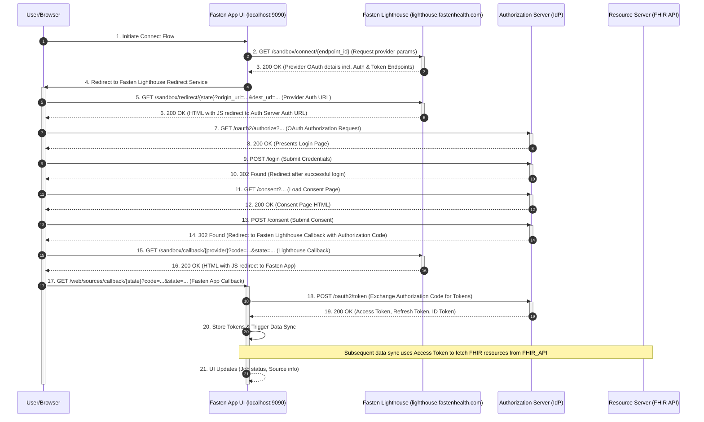

# Technical Context: Fasten On-Prem

## Overall Architecture

Fasten On-Prem employs a client-server architecture with a Go-based backend and an Angular frontend. The project is structured as a monorepo, which also includes a shared TypeScript library (`frontend/src/lib/`) intended for use in both the frontend and potential Web Workers or Node.js environments.

## Backend Technologies

*   **Language:** Go
    *   Main application entry point: `backend/cmd/fasten/fasten.go`
    *   Resource handling: `backend/resources/related_versions.go` (example)
*   **Dependency Management:** Go Modules (`go.mod`, `go.sum`)
*   **API:** Likely a RESTful API serving the Angular frontend.

## Frontend Technologies

*   **Framework:** Angular
    *   Configuration: `angular.json`
    *   Main module: `frontend/src/app/app.module.ts`
    *   Routing: `frontend/src/app/app-routing.module.ts`
*   **Language:** TypeScript
    *   Configuration: `frontend/tsconfig.json`, `frontend/tsconfig.app.json`, `frontend/tsconfig.spec.json`
*   **Package Manager:** Yarn (`yarn.lock`, `frontend/.yarnrc.yml`, `frontend/package.json`)
*   **Styling:** SCSS
    *   Global styles: `frontend/src/custom.scss`, `frontend/src/styles.scss`
    *   Component-level styles are also used.
*   **Component Structure:**
    *   Reusable UI components: `frontend/src/app/components/` (e.g., `fhir-card`, `header`, `footer`)
    *   Page-level components: `frontend/src/app/pages/` (e.g., `dashboard`, `medical-history`)
*   **State Management:** While not explicitly defined by file names, Angular applications typically use services (e.g., `frontend/src/app/services/auth.service.ts`, `frontend/src/app/services/fasten-api.service.ts`) for state management, potentially in conjunction with RxJS.
*   **Testing:**
    *   Unit Testing: Karma (`frontend/karma.conf.js`)
    *   End-to-End (E2E) Testing: Protractor (`frontend/e2e/protractor.conf.js`)
*   **Build System:** Angular CLI (implied by `angular.json` and standard Angular project structure).
*   **Linting:** TSLint (`frontend/tslint.json`), EditorConfig (`frontend/.editorconfig`).
*   **Browser Compatibility:** `.browserslistrc` defines target browsers.
*   **Shared Library (`frontend/src/lib/`):** Contains TypeScript code intended for use across different JavaScript environments (Angular, Web Workers, potentially Node.js). Code in this directory must avoid browser-specific APIs.

## API & Data Interchange

*   **Frontend-Backend Communication:** The Angular frontend likely communicates with the Go backend via HTTP requests.
*   **Type Safety:** `tygo.yaml` suggests the use of Tygo to generate TypeScript types from Go structs, ensuring consistency between frontend and backend data models.
*   **Data Standards:** FHIR (Fast Healthcare Interoperability Resources) is the primary data standard used for representing and exchanging healthcare information.
    *   **What is FHIR?** FHIR is a standard for exchanging healthcare information electronically. It defines a set of "Resources" that represent granular clinical and administrative concepts (like Patient, Observation, Condition, etc.) and specifies how these resources can be exchanged using modern web standards, primarily RESTful APIs.
    *   **Role in Fasten On-Prem:** FHIR is fundamental to Fasten On-Prem's ability to connect to and retrieve data from diverse healthcare provider systems. It provides the common language and structure needed to understand and store data from thousands of different sources.
    *   **Supported Versions:** Fasten On-Prem currently supports **FHIR R4** and **FHIR R3**. R4 is the current normative version, while R3 is still widely used. Supporting both ensures compatibility with a broader range of provider systems.
*   **Provider Source Catalog (`fastenhealth/fasten-sources`):** The comprehensive list of healthcare providers (brands, endpoints, portals) that Fasten On-Prem can connect to is defined and maintained in a separate GitHub repository: `https://github.com/fastenhealth/fasten-sources`.
    *   This repository contains structured data, primarily in JSON files located in the `catalog/` directory (e.g., `brands.json`, `endpoints.json`, `portals.json`).
    *   This repository acts as the central source of truth for provider information.
    *   The data from `fasten-sources` is consumed by the **Fasten Lighthouse** service, which then makes this catalog information available to the `fasten-onprem` application for dynamic discovery and connection.
*   **Data Fetching & Transformation:** The `conduit` library (located within `frontend/src/lib/`) is a key component responsible for retrieving patient data from various medical providers and transforming it into the internal data model used by Fasten On-Prem.
    *   `conduit` interacts with healthcare provider systems using the **FHIR R4** and **FHIR R3** protocols via their exposed APIs.
    *   It handles the authentication (using SMART-on-FHIR/OAuth2) and data retrieval process.
    *   After fetching FHIR Resources, `conduit` transforms this data into a format suitable for local storage and use within the Fasten On-Prem application.

    *   **SMART-on-FHIR Technical Details:** Fasten On-Prem leverages SMART-on-FHIR, which builds upon OAuth 2.0, for secure authorization. It primarily uses the **Authorization Code Grant** flow for user-facing data access. Key technical aspects include:
        *   **Authorization Server:** Healthcare providers expose an authorization server endpoint where users are directed to grant permissions.
        *   **Token Endpoint:** Providers also expose a token endpoint where Fasten On-Prem exchanges the authorization code for access and refresh tokens.
        *   **Scopes:** Fasten On-Prem requests specific scopes (e.g., `patient/*.read`, `offline_access`) to define the level of access required. The `offline_access` scope is crucial for enabling the application to fetch data periodically in the background without requiring the user to log in repeatedly.
        *   **Access Tokens:** Short-lived credentials used to authorize requests to the FHIR API. These are included in the `Authorization: Bearer <access_token>` header.
        *   **Refresh Tokens:** Long-lived credentials (issued when `offline_access` is granted) used to obtain new access tokens when the current one expires, maintaining continuous data synchronization.
        *   **Client Authentication:** When exchanging the authorization code for tokens at the token endpoint, Fasten On-Prem (as a confidential client) likely uses **symmetric client authentication** by providing its `client_id` and `client_secret` (if registered as confidential) via HTTP Basic authentication or in the request body. Asymmetric authentication (using public/private keys) is also part of the SMART specification but is less common for user-facing apps like Fasten.
        *   **Fasten Lighthouse's Role in Authentication:** Fasten Lighthouse acts as an "Auth Gateway" or proxy in the SMART-on-FHIR flow, particularly for providers requiring **Confidential Clients** or when the self-hosted Fasten instance is not directly internet-accessible.
            *   It securely stores the `client_secret` for Confidential Clients centrally, preventing the need to distribute these secrets to each user's self-hosted instance.
            *   It proxies the **token exchange** step (exchanging the authorization code for access/refresh tokens) for Confidential Clients, using the securely stored `client_secret`.
            *   It leverages **PKCE (Proof Key for Code Exchange)** to enhance security, ensuring that even if an authorization code is intercepted, it cannot be exchanged for a token without the `code_verifier` held by the Fasten client.
            *   It utilizes **Fragment Response Mode** during the redirect back to the client, ensuring the authorization code is passed in the URL fragment and is not sent to the Lighthouse server.
            *   Patient health data (FHIR resources) **never passes through Lighthouse**. Data retrieval is always a direct connection between the self-hosted Fasten instance and the healthcare provider's FHIR API.
        *   The `conduit` library is responsible for managing this OAuth 2.0 flow, including handling redirects, token exchange (either directly with the provider for Public Clients or via Lighthouse for Confidential Clients), token storage, and using tokens for API calls.

## Detailed Explanation of the Authentication Flow (Simplified and Generalized)

This explanation outlines the core steps of the SMART-on-FHIR authentication flow used by Fasten On-Prem to connect to a Healthcare Provider's system, leveraging the Fasten Lighthouse service. The flow follows the OAuth 2.0 Authorization Code Grant pattern with PKCE and is generalized to apply to any compatible provider, separating the roles of the Authorization Server (Identity Provider) and the Resource Server (FHIR API).

1.  **Initiate Connect Flow (User/Browser -> Fasten App UI):** The user begins the process of connecting a new healthcare provider within the Fasten App user interface.

2.  **Request Provider Parameters (Fasten App UI -> Fasten Lighthouse):** The Fasten App makes an API request to the Fasten Lighthouse service to retrieve the necessary OAuth and FHIR endpoint details for the selected healthcare provider.

3.  **Provide Provider OAuth Details (Fasten Lighthouse -> Fasten App UI):** Fasten Lighthouse responds with the provider's OAuth authorization endpoint, token endpoint (belonging to the Authorization Server), and potentially the FHIR service base URL (belonging to the Resource Server), along with other required parameters like the client ID.

4.  **Redirect to Fasten Lighthouse Redirect Service (Fasten App UI -> User/Browser):** The Fasten App redirects the user's browser to a specific redirect service hosted by Fasten Lighthouse. This redirect includes parameters like the original Fasten App callback URL and the Authorization Server's authorization endpoint URL.

5.  **Process Redirect (User/Browser -> Fasten Lighthouse):** The user's browser navigates to the Fasten Lighthouse redirect service.

6.  **HTML with JS Redirect to Auth Server Auth URL (Fasten Lighthouse -> User/Browser):** Lighthouse responds with an HTML page containing JavaScript. This script stores the context (like the original Fasten App callback) and redirects the user's browser to the Authorization Server's `/oauth2/authorize` endpoint.

7.  **OAuth Authorization Request (User/Browser -> Auth Server):** The user's browser sends a GET request to the Authorization Server's `/oauth2/authorize` endpoint. This request includes standard OAuth parameters such as `client_id`, `redirect_uri` (pointing back to Fasten Lighthouse), `response_type=code`, requested `scope` (defining the data access permissions), `state`, `code_challenge`, and `code_challenge_method`.

8.  **Presents Login Page (Auth Server -> User/Browser):** The Authorization Server processes the request and, after any necessary internal steps (like session checks, which are omitted in this simplified view), presents the user with the provider's login page.

9.  **Submit Credentials (User/Browser -> Auth Server):** The user enters their credentials on the provider's login page and submits them to the Authorization Server's `/login` endpoint.

10. **Redirect after successful login (Auth Server -> User/Browser):** Upon successful authentication, the Authorization Server redirects the user's browser.

11. **Load Consent Page (User/Browser -> Auth Server):** The user is directed to the Authorization Server's consent page (`/consent`), where they are asked to authorize Fasten Health to access their health data according to the requested scopes.

12. **Consent Page HTML (Auth Server -> User/Browser):** The Authorization Server sends the HTML content for the consent page to the user's browser.

13. **Submit Consent (User/Browser -> Auth Server):** The user interacts with the consent page, selecting permissions and duration, and submits their choices to the Authorization Server's `/consent` endpoint.

14. **Redirect to Fasten Lighthouse Callback with Authorization Code (Auth Server -> User/Browser):** After the user grants consent (and potentially handles internal session management steps), the Authorization Server redirects the user's browser back to the `redirect_uri` specified in the initial authorization request (which is the Fasten Lighthouse callback URL). This redirect includes the authorization `code` and the original `state` parameter.

15. **Lighthouse Callback (User/Browser -> Fasten Lighthouse):** The user's browser requests the Fasten Lighthouse callback URL, including the `code` and `state`.

16. **HTML with JS Redirect to Fasten App (Fasten Lighthouse -> User/Browser):** Lighthouse's callback page processes the request, retrieves the original Fasten App callback URL using the `state`, and responds with an HTML page containing JavaScript that redirects the user's browser back to the Fasten App, passing the `code` and `state`.

17. **Fasten App Callback (User/Browser -> Fasten App UI):** The user's browser returns to the Fasten App's local callback URL. The Fasten App UI receives the authorization `code` and `state`.

18. **Exchange Authorization Code for Tokens (Fasten App UI -> Auth Server):** The Fasten App (specifically its backend, likely triggered by the UI) makes a direct POST request to the Authorization Server's `/oauth2/token` endpoint. This is a server-to-server request. The request body includes the `grant_type=authorization_code`, the received `code`, the `redirect_uri`, the `client_id`, and the `code_verifier` (for PKCE). If Fasten Health is a confidential client, client authentication (e.g., using a `client_secret`) is also included.

19. **Provide Tokens (Auth Server -> Fasten App UI):** The Authorization Server validates the request. If valid, it responds with a 200 OK containing a JSON object that includes the `access_token`, `refresh_token` (if requested and granted), and `id_token`.

20. **Store Tokens & Trigger Data Sync (Fasten App UI -> Fasten App UI):** The Fasten App receives the tokens, stores them securely (e.g., in its local database), and triggers a background data synchronization job.

21. **UI Updates (Fasten App UI -> Fasten App UI):** The Fasten App UI updates to reflect the successful connection and potentially shows the status of the ongoing data synchronization job. The data sync process itself involves the Fasten App backend using the obtained `access_token` to make requests to the **Resource Server (FHIR API)** to fetch the actual patient health data.

## Data Storage (Frontend)

*   **Local Database:** The frontend utilizes a library (located within `frontend/src/lib/database/`) that acts as a wrapper around **PouchDB** for managing local, client-side data storage.
*   **Synchronization:** This PouchDB wrapper includes built-in functionality to synchronize the local database with an external or hosted **CouchDB** instance.

## Build, Deployment, and Environment

*   **Containerization:** Docker (`Dockerfile`, `docker-compose.yml`) is used for creating and managing application containers. `.dockerignore` specifies files to exclude from Docker images.
*   **Build Automation:** `Makefile` provides build scripts and automation.
*   **Package Building:** `packagr.yml` (purpose might be specific to the project's packaging needs, possibly for creating distributable versions).
*   **Reproducible Environments:** Nix (`flake.nix`, `flake.lock`) is used to define and manage reproducible development and build environments.
*   **Environment Variables:** `.envrc` suggests the use of `direnv` for managing environment-specific configurations.
*   **Environment-Specific Configurations (Frontend):** The `frontend/src/environments/` directory contains different configuration files for various deployment environments (e.g., `environment.dev.ts`, `environment.prod.ts`, `environment.desktop_prod.ts`).
*   **Version Scripting:** `frontend/git.version.sh` is likely used to embed Git version information into the frontend build.

## Version Control

*   **System:** Git
    *   `.gitignore` and `.gitattributes` manage versioned files and their attributes.

## Development Environment

*   **IDE/Editor:** `fasten-onprem.code-workspace` indicates usage of Visual Studio Code with a pre-configured workspace.

## Cross-Cutting Concerns

*   **Event Bus (Frontend):** `EventBusService` suggests a publish-subscribe mechanism for decoupled communication between components or services.
*   **HTTP Interceptors (Frontend):** `AuthInterceptorService` is used to modify outgoing HTTP requests (e.g., adding authentication tokens) or incoming responses.

## Service Discovery

*   **mDNS (Multicast DNS):** The backend uses mDNS to broadcast its presence on the local network. This allows the mobile client to automatically discover the backend's IP address and port without manual configuration.
    *   **Library:** The `github.com/grandcat/zeroconf` library is used to implement the mDNS server.
    *   **Configuration:** The service is highly configurable. Default settings are centralized in `backend/pkg/config/config.go`, and can be overridden by the user in `config.yaml` under the `mdns` key. This allows for enabling/disabling the service and customizing the name, service type, and domain.
    *   **Dynamic TXT Records:** The implementation dynamically includes metadata, such as the application version, in the broadcasted TXT records.
